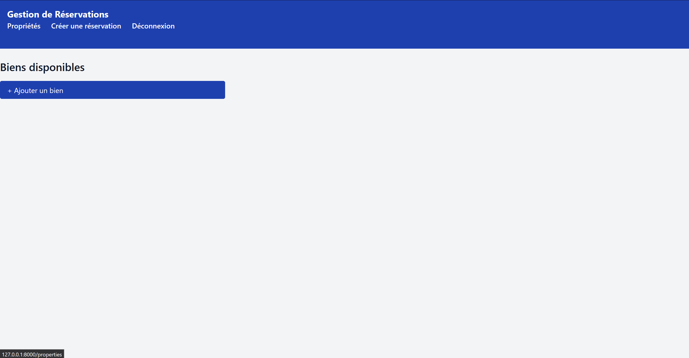
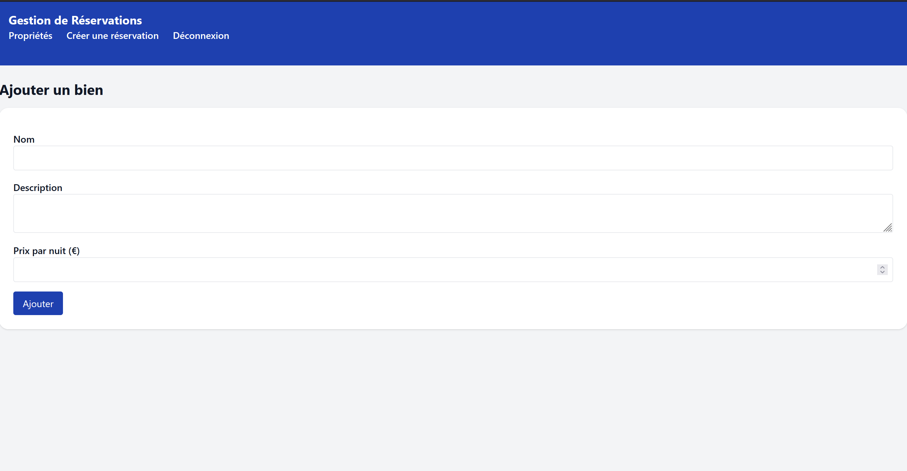
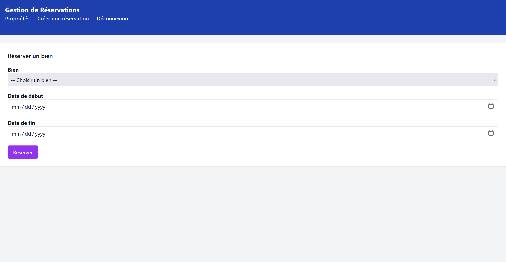
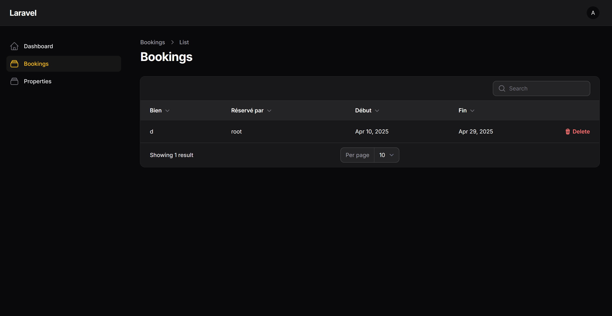
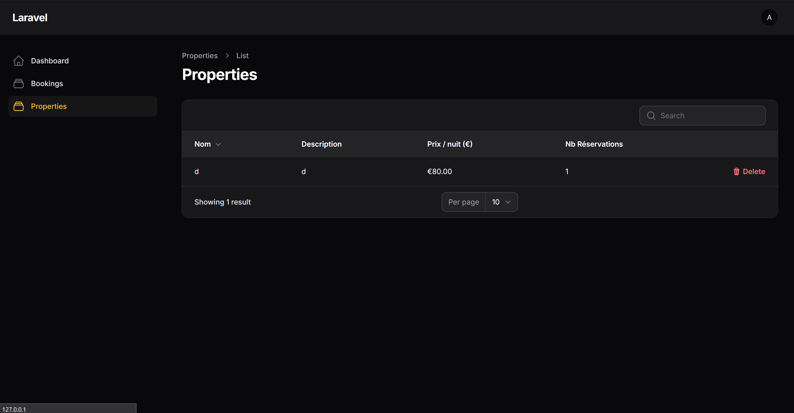

# Test technique - Projet Laravel pour Innovqube
Il s'agit d'une application de gestion de réservation immobilières.

## Fonctionalité
- Ajout de propriétés
- Réservation de propriétes
- Un panneau d'administration qui permet de retirer des réservation ou des propriétes

## Outils
- PHP 8.4.5
- Composer 2.8.8
- Node.js v22.14.0
- NPM 10.9.2
- MySQL via XAMPP
- Git 2.44.0.windows.1
- Laravel Framework 12.7.2
- Laravel Breeze v2.3.6
- Livewire v3.6.2
- Filament v3.3.8
- TailwindCSS 3.1.0

## Lancer le projet
```bash
cd laravel-test
composer install
npm install
npm run dev
```
- Puis sur un autre terminal
```bash
php artisan key:generate
php artisan migrate
php artisan serve
```
- Login

Admin: alex@test.com:123456789

User: root@gmail.com:12345678

## Capture d'écran

### Accueil


### Proprieté


### Création Propriété


### Propriété avec celle créer


### Réservation 


### Accueil Admin


### Réservation Admin


### Propriété Admin

